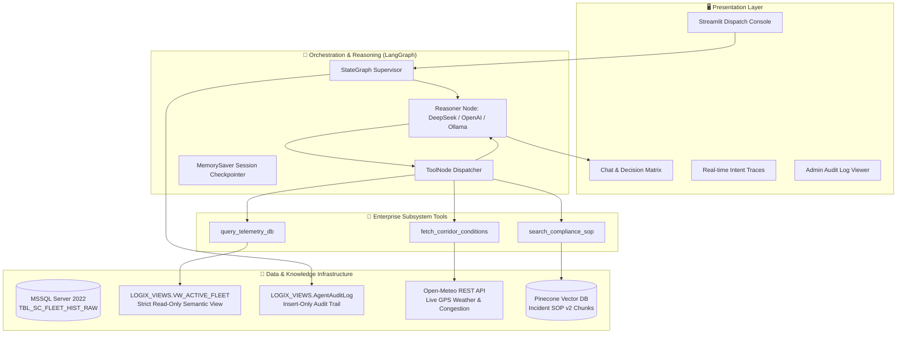

# 🧊 Logix AI: Autonomous Cold-Chain Dispatch & Logistics Assistant

[](https://python.org)
[](https://streamlit.io)
[](https://langchain.com)
[](https://pinecone.io)
[](https://microsoft.com)
[](https://docker.com)
[](LICENSE)

An enterprise-grade, agentic AI platform designed for real-time cold-chain logistics monitoring, anomaly detection, incident escalation, and dispatch optimization. 

Logix AI bridges raw legacy database telemetry, real-time external weather/corridor condition APIs, and regulatory Standard Operating Procedures (SOPs) into an autonomous, reasoning-driven decision support system built on **LangGraph** and deployed via **Streamlit**.

---

## 🏛️ Architecture Overview



---

## ✨ Key Features

1. **Deterministic Multi-Step Reasoning**:
   - Built on **LangGraph** state graph cycle (`START` ➔ `reasoner` ⇄ `tools` ➔ `END`).
   - Grounded operational execution: Telemetry DB check ➔ Corridor hazard query ➔ Vector SOP retrieval ➔ Structured action plan synthesis.

2. **Enterprise Database Security by Design**:
   - Complete segregation of dirty legacy schemas (`dbo.TBL_SC_FLEET_HIST_RAW`) from AI consumption.
   - Dedicated `LOGIX_VIEWS` schema with clean semantic view (`VW_ACTIVE_FLEET`).
   - Restricted database login (`USR_LOGIX_RO`) with strict `SELECT` rights only on the view and explicit `DENY` rules on raw tables.

3. **External Real-Time Corridor Grounding**:
   - Live GPS queries against Open-Meteo REST API to evaluate ambient temperature and compute route congestion indices.

4. **Self-Healing SOP Vector Search**:
   - Polymorphic parser supporting `.md`, `.pdf`, `.txt`, `.csv`, and `.xlsx`.
   - Incremental batch ingestion engine with MD5 hash caching to minimize vector DB costs.
   - Dual-mode embedding support: Cloud **OpenAI** (1536-dim) or Local **HuggingFace BAAI/bge-m3** (1024-dim).

5. **Multi-Provider LLM Brain**:
   - Dynamic configuration supporting **DeepSeek** (`deepseek-v4-pro`, `deepseek-v4-flash`), **OpenAI** (`gpt-4o`), or Local **Ollama** (`qwen2.5:7b`).

6. **Full Observability & Security Audit Trail**:
   - Real-time intent recognition and parameter inspection expanders in the UI.
   - Secure logging of every agent invocation to `LOGIX_VIEWS.AgentAuditLog`.
   - Admin-gated credential view for compliance inspection.

7. **Production CI/CD Automation**:
   - GitHub Actions workflow (`deploy.yml`) for automated dispatch deployment to AWS EC2 over SSH with Systemd service orchestration.

---

## 📂 Project Structure

```bash
logix-ai/
├── .github/
│   └── workflows/
│       └── deploy.yml               # Automated EC2 CI/CD deployment pipeline
├── .streamlit/
│   └── config.toml                  # Enterprise dark UI styling tokens
├── data/
│   ├── cache/
│   │   └── ingestion_hash_cache.json # Incremental SOP ingestion state tracking
│   ├── policy/
│   │   └── Cold_Chain_Incident_SOP_v2.md # Regulatory compliance protocols
│   ├── raw/
│   │   └── dynamic_supply_chain_logistics_dataset.csv # Fleet sensor telemetry
│   └── source/
│       └── data.txt                 # Source dataset provenance references
├── docs/
│   ├── TECHNICAL_DESIGN_DOCUMENT.md # Full architecture specifications & schemas
│   └── instructions.md              # Complete end-to-end deployment runbook
├── scripts/
│   ├── ingest_legacy_data.py        # Raw CSV to MSSQL staging pipeline
│   ├── ingest_sop_pinecone.py       # SOP ingestion & Pinecone index manager
│   └── setup_security_and_view.sql  # T-SQL security roles & semantic views
├── src/
│   ├── prompts/
│   │   └── system_prompt.txt        # Structured business output templates
│   ├── agent_tools.py               # LangChain tools (MSSQL, Weather, Vector)
│   ├── orchestrator.py              # LangGraph compilation & agent runtime
│   └── ui.py                        # Streamlit command center application
├── .env.example                     # Environment template
├── .gitignore                       # Project git exclusions
├── requirements.txt                 # Pinned project dependencies
├── LICENSE                          # MIT License
└── README.md                        # Documentation
```

---

## 🚀 Quickstart Guide

### 1. Environment Setup

Clone the repository and set up a Python virtual environment:

```bash
git clone git@github.com:superezzdev/logix-ai.git
cd logix-ai

python3 -m venv venv
source venv/bin/activate
pip install -r requirements.txt
```

Copy the environment template and fill in your API credentials:

```bash
cp .env.example .env
```

### 2. Launch the Legacy MSSQL Database

Start a local Microsoft SQL Server 2022 container using Docker:

```bash
docker run -e "ACCEPT_EULA=Y" \
  -e "MSSQL_SA_PASSWORD=LogixEnterprise2026!" \
  -p 1433:1433 \
  --name legacy-mssql \
  -d mcr.microsoft.com/mssql/server:2022-latest
```

### 3. Ingest Fleet Telemetry & Apply Security Layer

1. Load raw supply chain telemetry into the MSSQL database:
   ```bash
   python scripts/ingest_legacy_data.py
   ```

2. Execute `scripts/setup_security_and_view.sql` in Azure Data Studio or VS Code mssql extension using administrative credentials (`sa`) to initialize the `LOGIX_VIEWS` schema, create the `VW_ACTIVE_FLEET` semantic view, and provision the restricted `USR_LOGIX_RO` login.

3. Provision the audit table:
   ```sql
   CREATE TABLE LOGIX_VIEWS.AgentAuditLog (
       LogID INT IDENTITY(1,1) PRIMARY KEY,
       Timestamp DATETIME DEFAULT GETDATE(),
       SessionID VARCHAR(50),
       NodeExecuted VARCHAR(50),
       ToolName VARCHAR(100),
       Content NVARCHAR(MAX)
   );
   GRANT INSERT ON LOGIX_VIEWS.AgentAuditLog TO USR_LOGIX_RO;
   ```

### 4. Index Enterprise SOPs into Pinecone

Vectorize standard operating procedures and index into Pinecone:

```bash
python scripts/ingest_sop_pinecone.py
```

### 5. Launch the Streamlit Dispatch Console

Launch the web dashboard:

```bash
streamlit run src/ui.py
```

Access the application in your browser at `http://localhost:8501`.

---

## 🧪 Operational Evaluation & Verification

To verify agent grounding and tool restraint, submit the following standard evaluation prompts in the Dispatch Console:

* **Domino Effect Multi-Hop Test:**
  > *"Find any active shipments near Los Angeles (Latitude ~33.8, Longitude ~-118.1). Check the local weather there, and tell me if the current cargo temperature violates the SOP for fresh perishables."*
  - Expected: Queries SQL view ➔ Calls Open-Meteo API ➔ Retrieves Pinecone SOP ➔ Outputs structured 3-part business report.

* **Restraint Test (No-Tool Direct Answering):**
  > *"I'm a new dispatcher on the night shift. Can you quickly explain the difference between a Tier 1 and Tier 2 escalation?"*
  - Expected: Direct policy retrieval without redundant SQL queries.

---

## 🚢 Production Deployment

The project includes production-ready deployment configurations:
- **Systemd Service**: Run Streamlit persistently under Linux supervisor (`/etc/systemd/system/streamlit.service`).
- **CI/CD Automation**: GitHub Actions workflow deploying to AWS EC2 over SSH automatically upon workflow dispatch.

Refer to [`docs/instructions.md`](docs/instructions.md) for full production deployment instructions.

---

## 📄 License

This project is licensed under the MIT License - see the [LICENSE](LICENSE) file for details.
