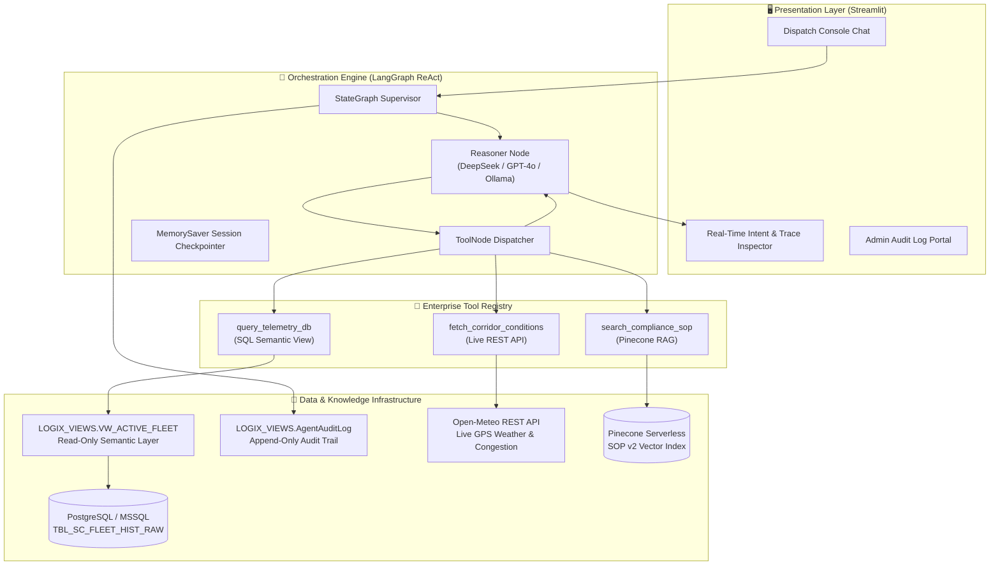
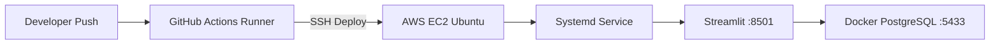

# 🧊 Logix AI — Autonomous Cold-Chain Dispatch & Logistics Intelligence Platform

<div align="center">

**Live Deployment → [logix.superezz.dev](https://logix.superezz.dev)**

[](https://python.org)
[](https://streamlit.io)
[](https://langchain.com)
[](https://pinecone.io)
[](https://postgresql.org)
[](https://microsoft.com)
[](https://docker.com)
[](https://aws.amazon.com)
[](https://github.com/features/actions)
[](LICENSE)

</div>

---

> **Logix AI** is a production-deployed, enterprise-grade **Agentic AI** platform that autonomously reasons across structured SQL telemetry, live REST APIs, and a compliance vector knowledge base to provide real-time cold-chain incident analysis, risk classification, and dispatch recommendations — all driven by a structured **LangGraph ReAct state machine**.

---

## 🎯 What This Project Demonstrates

This is not a tutorial project or a proof-of-concept. Every design decision reflects real-world production engineering standards:

| Engineering Domain | Skills Demonstrated |
|---|---|
| **Agentic AI Architecture** | LangGraph ReAct cyclic state machine, multi-tool orchestration, deterministic reasoning flow |
| **LLM Integration** | Multi-provider factory pattern (DeepSeek, OpenAI GPT-4o, Ollama) with dynamic binding |
| **Vector Search & RAG** | Pinecone serverless indexing, dual-mode embeddings (OpenAI 1536-dim / HuggingFace BGE-M3 1024-dim), incremental hash-cache ingestion |
| **Database Engineering** | Schema isolation, RBAC security hardening, semantic view abstraction, dual dialect support (PostgreSQL / MSSQL) |
| **Data Engineering** | CSV-to-SQL ETL pipeline, legacy schema transformation, polymorphic document parser (MD, PDF, TXT, CSV, XLSX) |
| **REST API Integration** | Real-time GPS-based weather & corridor condition grounding via Open-Meteo |
| **Security Engineering** | Principle of Least Privilege, SQL injection prevention, read-only agent credentials, admin-gated audit inspection |
| **Production DevOps** | Docker containerization, GitHub Actions CI/CD, AWS EC2 deployment, Linux Systemd service supervision |
| **Full-Stack UI** | Streamlit command center with real-time intent traces, chat interface, and secure admin audit log portal |
| **Observability** | Append-only SQL audit trail logging every agent invocation, session token tracking, tool trace inspection |

---

## 🏛️ System Architecture

The platform is designed as a **decoupled three-tier intelligence system**. The UI layer is stateless and performs no heavy computation — all reasoning, retrieval, and synthesis is handled entirely by the orchestration engine.


```mermaid
flowchart TD
    subgraph UI ["🖥️ Presentation Layer (Streamlit)"]
        A[Dispatch Console Chat]
        A1[Real-Time Intent & Trace Inspector]
        A2[Admin Audit Log Portal]
    end

    subgraph AgentEngine ["🧠 Orchestration Engine (LangGraph ReAct)"]
        B[StateGraph Supervisor]
        B1["Reasoner Node\n(DeepSeek / GPT-4o / Ollama)"]
        B2[ToolNode Dispatcher]
        B3[MemorySaver Session Checkpointer]
    end

    subgraph Tools ["🔧 Enterprise Tool Registry"]
        T1["query_telemetry_db\n(SQL Semantic View)"]
        T2["fetch_corridor_conditions\n(Live REST API)"]
        T3["search_compliance_sop\n(Pinecone RAG)"]
    end

    subgraph DataLayer ["💾 Data & Knowledge Infrastructure"]
        D1[("PostgreSQL / MSSQL\nTBL_SC_FLEET_HIST_RAW")]
        D2["LOGIX_VIEWS.VW_ACTIVE_FLEET\nRead-Only Semantic Layer"]
        D3["LOGIX_VIEWS.AgentAuditLog\nAppend-Only Audit Trail"]
        D4["Open-Meteo REST API\nLive GPS Weather & Congestion"]
        D5[("Pinecone Serverless\nSOP v2 Vector Index")]
    end

    A --> B
    B --> B1
    B1 --> B2
    B2 --> T1 & T2 & T3
    T1 --> D2
    T2 --> D4
    T3 --> D5
    D2 --> D1
    B2 --> B1
    B1 --> A1
    B --> D3
```

---

## ⚙️ Core Engineering Deep-Dive

### 1. LangGraph ReAct Agent — `src/orchestrator.py`

The heart of the system is a **cyclic LangGraph state machine** implementing the ReAct (Reason + Act) pattern:

```
START ──► reasoner ◄──► tools ──► END
```

- **`AgentState`** — A `TypedDict` with `Annotated[list[BaseMessage], add_messages]` for type-safe, append-only message accumulation.
- **`reasoning_node`** — Calls `llm.bind_tools(logix_tools)` so the LLM autonomously decides *when* and *which* tool to invoke — no hardcoded routing.
- **`tools_condition`** — LangGraph's prebuilt conditional edge that routes back to `reasoner` if tool calls were emitted, or terminates at `END` if the final answer is ready.
- **`MemorySaver`** — In-process session checkpointing with thread-isolated conversation state keyed by UUID session tokens.

**Multi-Provider LLM Factory:** A single `Agent_llm` env variable routes between cloud and local providers at startup — no code changes required to switch:

```
DEEPSEEK  → ChatOpenAI(base_url="api.deepseek.com", model="deepseek-flash")
OPENAI    → ChatOpenAI(model="gpt-4o")
OLLAMA    → ChatOllama(model="qwen2.5:7b")  ← fully offline/air-gapped capable
```

---

### 2. Enterprise Tool Registry — `src/agent_tools.py`

Three `@tool`-decorated functions form the agent's entire knowledge surface. The LLM never accesses raw data directly — it reasons through structured tool contracts:

#### `query_telemetry_db(sql_query: str)`
- Executes **agent-generated SQL** against a read-only semantic view.
- Auto-translates T-SQL `SELECT TOP N` syntax to PostgreSQL `LIMIT N` for cross-dialect compatibility.
- Hard-coded security block: rejects any query that doesn't start with `SELECT`.
- Dual-dialect engine factory: resolves connection string from environment variables at runtime.

#### `fetch_corridor_conditions(latitude, longitude)`
- Calls the **Open-Meteo live REST API** with GPS coordinates extracted from telemetry.
- Computes a real-time corridor congestion index based on wind speed thresholds.
- Returns structured plain-text telemetry for LLM consumption.

#### `search_compliance_sop(query: str)`
- Performs **semantic similarity search** on the Pinecone vector index.
- Returns source-attributed document chunks (`source_file`, `file_format`, `document_type` metadata).
- Dual-mode: routes to OpenAI (1536-dim) or HuggingFace BGE-M3 (1024-dim) embeddings based on env config.
- Uses `st.cache_resource` for zero-cost model reloading across Streamlit reruns.

---

### 3. Database Security Architecture

A core design principle: **the AI agent never touches raw data**.

```
┌─────────────────────────────────────────────┐
│  dbo.TBL_SC_FLEET_HIST_RAW  (Legacy Schema) │  ← REVOKE all access from AI agent
│  Messy column names, raw IoT sensor feed    │
└────────────────────┬────────────────────────┘
                     │  CREATE VIEW
                     ▼
┌─────────────────────────────────────────────┐
│  LOGIX_VIEWS.VW_ACTIVE_FLEET  (Semantic)    │  ← SELECT granted to AI agent only
│  Clean English column names, typed columns  │
└─────────────────────────────────────────────┘
```

**RBAC Implementation (PostgreSQL):**

```sql
-- Agent gets SELECT only on the sanitized semantic view
GRANT SELECT ON logix_views.vw_active_fleet TO usr_logix_ro;

-- Explicit revoke on the raw legacy table
REVOKE ALL ON TABLE public."TBL_SC_FLEET_HIST_RAW" FROM usr_logix_ro;

-- Agent can write audit logs (INSERT only)
GRANT SELECT, INSERT ON logix_views.agentauditlog TO usr_logix_ro;
```

**Dual Dialect Support:** A single codebase handles both PostgreSQL and MS SQL Server 2022 — engine factory selects the correct driver (`psycopg2` vs `pymssql`/`pyodbc`) and adapts schema references at runtime.

---

### 4. Vector Knowledge Base — `scripts/ingest_sop_pinecone.py`

A production-grade RAG ingestion pipeline with these design patterns:

- **Polymorphic Parser**: Single function handles `.md` (header-aware Markdown splitting), `.pdf` (page-level extraction via pypdf), `.txt`, `.csv`, and `.xlsx` files.
- **Incremental Ingestion with MD5 Hash Cache**: Files are only re-embedded and re-upserted if their content has changed — dramatically reduces API costs in repeated runs.
- **Self-Healing Index Validation**: Detects if an existing Pinecone index was created with the wrong embedding dimension and auto-recreates it.
- **Batched Upsert**: Chunks are upserted in configurable batches of 100 with deterministic IDs (`{filename}-chunk-{idx}`) for idempotent reruns.
- **Isolated Index Namespacing**: `logix-sop-openai` vs `logix-sop-local` — switching embedding models doesn't corrupt existing indexes.

---

### 5. Production UI — `src/ui.py`

Built on Streamlit with production-quality patterns:

- **Thread-Isolated Sessions**: Every browser tab gets a UUID `thread_id` — completely isolated agent conversation state.
- **Streaming Agent Execution**: Uses `logix_agent.stream(..., stream_mode="updates")` to display reasoning steps in real-time as the graph traverses nodes.
- **Live Intent Inspector**: Every tool call emits its name and generated parameters to the UI in an expandable JSON view before execution.
- **Self-Healing Thread Recovery**: Detects corrupted thread state (dangling `tool_call_id`) and automatically spawns a fresh conversation thread without user intervention.
- **Admin Audit Portal**: A separate, credential-gated view renders the `AgentAuditLog` table using `pandas` + Streamlit's `column_config` API.
- **Enterprise Dark Theme**: Custom CSS injected for dark-mode enterprise aesthetics.

---

### 6. CI/CD & Production Infrastructure


```mermaid
flowchart LR
    Dev[Developer Push] --> GH[GitHub Actions Runner]
    GH --> |SSH Deploy| EC2[AWS EC2 Ubuntu]
    EC2 --> Systemd[Systemd Service]
    Systemd --> Streamlit[Streamlit :8501]
    Streamlit --> Docker[Docker PostgreSQL :5433]
```

- **GitHub Actions** (`deploy.yml`): `workflow_dispatch`-triggered pipeline using encrypted repository secrets (`EC2_HOST`, `EC2_USER`, `EC2_SSH_KEY`) for zero-credential deployment.
- **AWS EC2**: Ubuntu Linux host — `git pull` + `source venv/bin/activate` + `sudo systemctl restart streamlit`.
- **Systemd Service**: Streamlit runs as a persistent Linux daemon — auto-restarts on crash, survives reboots.
- **Docker Database**: PostgreSQL 16 (Alpine) containerized on the EC2 instance — port 5433 bound to localhost only, never exposed to public routing.

---

## 🧰 Full Technology Stack

| Layer | Technology | Version | Purpose |
|---|---|---|---|
| **Language** | Python | 3.12 | Core runtime |
| **Agentic Framework** | LangGraph | 0.2.73 | ReAct state machine orchestration |
| **LLM Providers** | DeepSeek / OpenAI / Ollama | Latest | Multi-provider reasoning brain |
| **LangChain Core** | langchain-openai, langchain-community | 0.3.x | LLM adapters & tool contracts |
| **Vector DB** | Pinecone Serverless | 6.0.2 | SOP semantic retrieval |
| **Embeddings (Cloud)** | OpenAI text-embedding-3-small | — | 1536-dim vector space |
| **Embeddings (Local)** | HuggingFace BAAI/bge-m3 | sentence-transformers 3.4 | 1024-dim, offline capable |
| **Relational DB** | PostgreSQL 16 / MS SQL Server 2022 | — | Fleet telemetry storage |
| **ORM / SQL** | SQLAlchemy | 2.0.36 | Cross-dialect DB abstraction |
| **DB Drivers** | psycopg2, pymssql, pyodbc | Latest | PostgreSQL & MSSQL connectivity |
| **Frontend** | Streamlit | 1.40.2 | Dispatch console UI |
| **Data Processing** | pandas | 2.2.3 | ETL, CSV ingestion, audit log display |
| **PDF Parsing** | pypdf | 5.6.0 | Policy document extraction |
| **REST API** | requests | — | Open-Meteo live corridor grounding |
| **ML Utilities** | scikit-learn, faiss-cpu | 1.6.1 / 1.9.0 | Similarity search utilities |
| **Deep Learning** | PyTorch | 2.2.2 | Local embedding model backend |
| **Environment** | python-dotenv | 1.0.1 | Secrets & config management |
| **Containerization** | Docker | — | DB isolation & portability |
| **Cloud Infra** | AWS EC2 | — | Production hosting |
| **CI/CD** | GitHub Actions | — | Automated zero-touch deployment |
| **Process Mgmt** | Linux Systemd | — | Persistent service supervision |
| **Version Control** | Git / GitHub | — | Source control |

---

## 📂 Project Structure

```
logix-ai/
├── .github/
│   └── workflows/
│       └── deploy.yml               # GitHub Actions → AWS EC2 CI/CD pipeline
├── .streamlit/
│   └── config.toml                  # Enterprise dark theme tokens
├── data/
│   ├── cache/
│   │   └── ingestion_hash_cache.json  # MD5 hash cache for incremental SOP ingestion
│   ├── policy/
│   │   └── Cold_Chain_Incident_SOP_v2.md  # Regulatory cold-chain compliance protocols
│   ├── raw/
│   │   └── dynamic_supply_chain_logistics_dataset.csv  # Fleet sensor telemetry dataset
│   └── source/
│       └── data.txt                 # Source dataset provenance
├── docs/
│   ├── TECHNICAL_DESIGN_DOCUMENT.md  # Full architecture specification & DB schemas
│   └── instructions.md               # End-to-end deployment runbook
├── scripts/
│   ├── ingest_legacy_data.py         # CSV → PostgreSQL/MSSQL ETL pipeline
│   ├── ingest_sop_pinecone.py        # Polymorphic SOP parser & Pinecone batch ingestor
│   ├── setup_security_and_view.sql   # T-SQL: RBAC roles, semantic views, audit table
│   └── setup_security_and_view_postgres.sql  # PostgreSQL: equivalent security layer
├── src/
│   ├── prompts/
│   │   └── system_prompt.txt         # Structured business output template for the LLM
│   ├── agent_tools.py                # @tool definitions: SQL, REST API, Vector Search
│   ├── orchestrator.py               # LangGraph graph compilation & LLM factory
│   └── ui.py                         # Streamlit command center
├── .env.example                      # Environment variable template
├── requirements.txt                  # Pinned production dependencies
├── LICENSE                           # MIT License
└── README.md
```

---

## 🚀 Quickstart

### Prerequisites
- Python 3.12+
- Docker (for the database)
- API Keys: [Pinecone](https://pinecone.io), [DeepSeek](https://platform.deepseek.com) or [OpenAI](https://platform.openai.com)

### 1. Clone & Environment Setup

```bash
git clone https://github.com/superezzdev/logix-ai.git
cd logix-ai

python3 -m venv venv
source venv/bin/activate  # On Windows: venv\Scripts\activate
pip install -r requirements.txt

cp .env.example .env
# Edit .env and fill in your API keys
```

### 2. Launch PostgreSQL Database

```bash
docker run --name logix-postgres \
  -e POSTGRES_PASSWORD=LogixEnterprise2026! \
  -e POSTGRES_DB=logix_db \
  -p 5433:5432 \
  -d postgres:16-alpine
```

> **Alternative:** MS SQL Server 2022 is also supported. Set `SQL_DIALECT=mssql` in `.env`.

### 3. Ingest Fleet Telemetry & Apply Security Layer

```bash
# Step 1: Load raw supply chain telemetry CSV into the database
python scripts/ingest_legacy_data.py

# Step 2: Create semantic views, RBAC roles, and audit table
docker exec -i logix-postgres psql -U postgres -d logix_db < scripts/setup_security_and_view_postgres.sql
```

### 4. Index Enterprise SOPs into Pinecone

```bash
python scripts/ingest_sop_pinecone.py
```

### 5. Launch Dispatch Console

```bash
streamlit run src/ui.py
```

Open **[http://localhost:8501](http://localhost:8501)** in your browser.

---

## 🧪 Evaluation Prompts

Use these to observe the agent's full multi-hop reasoning chain:

**🔴 Full Multi-Hop Domino Test** — triggers all 3 tools in sequence:
> *"Find any active shipments near Los Angeles (Latitude ~33.8, Longitude ~-118.1). Check the local weather there, and tell me if the current cargo temperature violates the SOP for fresh perishables."*

Expected execution chain:
```
[SQL: VW_ACTIVE_FLEET] → [REST: Open-Meteo API] → [Vector: Pinecone SOP] → [LLM: Structured Report]
```

**🟡 Tool Restraint Test** — direct LLM reasoning, no database queries:
> *"I'm a new dispatcher on the night shift. Can you quickly explain the difference between a Tier 1 and Tier 2 escalation?"*

---

## 🛡️ Security Model Summary

| Concern | Implementation |
|---|---|
| **SQL Injection** | Agent-generated queries validated: only `SELECT` statements execute |
| **Least Privilege** | `USR_LOGIX_RO` has `SELECT` on view only, `INSERT` on audit log only |
| **Data Isolation** | Raw legacy table is explicitly `REVOKE`d from the AI agent |
| **Credential Security** | All secrets in `.env`, never committed; GitHub Actions uses encrypted repository secrets |
| **Audit Trail** | Every tool call and LLM response is written to an append-only SQL audit log |
| **Admin Gate** | Audit log viewer requires separate admin credentials validated at runtime |
| **Network Isolation** | Database port bound to localhost inside EC2; never exposed to public internet |

---

## 🚢 Production Deployment

| Component | Technology | Details |
|---|---|---|
| **Host** | AWS EC2 (Ubuntu Linux) | Production server |
| **Process Supervisor** | Linux Systemd | Auto-restart on crash, survives reboots |
| **Database** | Docker PostgreSQL 16 | Internal port 5433, localhost-only binding |
| **CI/CD** | GitHub Actions | `workflow_dispatch` trigger, SSH deploy |
| **Live URL** | [logix.superezz.dev](https://logix.superezz.dev) | Custom subdomain, production-live |

Refer to [`docs/instructions.md`](docs/instructions.md) for the full deployment runbook and [`docs/TECHNICAL_DESIGN_DOCUMENT.md`](docs/TECHNICAL_DESIGN_DOCUMENT.md) for the complete low-level design.

---

## 📄 License

This project is licensed under the **MIT License** — see the [LICENSE](LICENSE) file for details.

---

<div align="center">

**Built with production intent. Every design decision reflects real engineering.**

[Live Demo](https://logix.superezz.dev) · [Technical Design Doc](docs/TECHNICAL_DESIGN_DOCUMENT.md) · [Deployment Runbook](docs/instructions.md)

</div>
