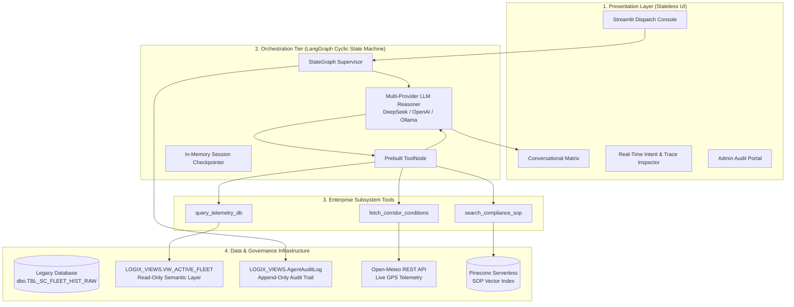
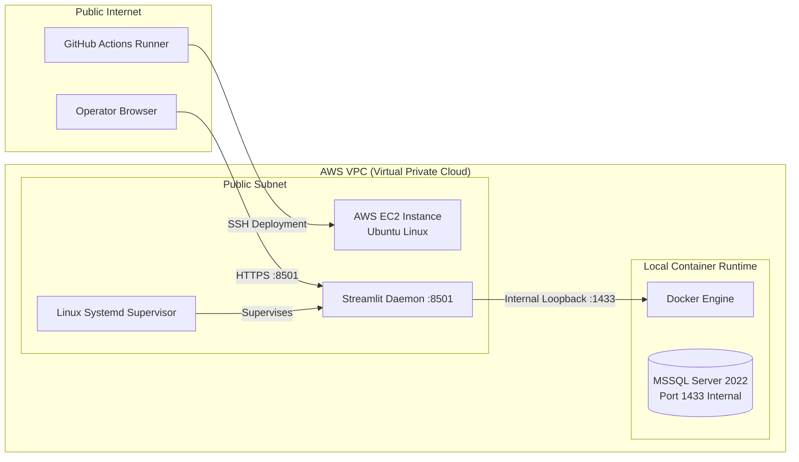

# Technical Design Document (TDD): Logix AI Assistant

**Author:** `superezzdev`  
**System:** Logix AI – Autonomous Cold-Chain Dispatch & Logistics Control Platform  
**Status:** Production Ready Architecture  
**Release Target:** v1.0.0 (September 2026)  

---

## 1. System Architecture (High-Level Design)

Logix AI is a decoupled, three-tier enterprise intelligence platform designed to enable control tower dispatchers to monitor fleet telemetry, anticipate refrigerated cargo ("reefer") temperature excursions, evaluate corridor weather hazards, and execute compliance standard operating procedures (SOPs) via natural language.



---

## 2. Component Responsibilities

### 2.1 Presentation Tier
* **Stateless Streamlit Engine**: Renders user interfaces and manages frontend session tokens (`st.session_state.thread_id`).
* **Zero Heavy Compute**: All semantic search, reasoning, and SQL transformations are offloaded strictly to the orchestration engine.
* **Audit Gate**: High-privilege administrative portal for inspecting immutable agent execution traces directly from the database.

### 2.2 Orchestration Tier (LangGraph)
* **ReAct Cyclic Graph**: Implements cyclic evaluation (`START` ➔ `reasoner` ⇄ `tools` ➔ `END`).
* **Multi-Provider LLM Engine**: Factory-driven model binding supporting:
  * **DeepSeek** (`deepseek-v4-pro`, `deepseek-v4-flash`) for low-cost, high-reasoning workloads.
  * **OpenAI** (`gpt-4o`) for standard cloud enterprise deployments.
  * **Ollama** (`qwen2.5:7b`) for offline or air-gapped secure edge runtime.
* **Resiliency & Self-Correction**:
  * Telemetry queries failing schema validations emit clear, structured security blocks rather than uncaught tracebacks.
  * Vector search returns source attribution and file formats for deterministic grounding.

### 2.3 Data & Governance Layer
* **Legacy Schema Isolation**: Untrusted raw tables (`dbo.TBL_SC_FLEET_HIST_RAW`) are completely hidden from the AI agent.
* **Sanitized Semantic Views**: Clean representation exposed via `LOGIX_VIEWS.VW_ACTIVE_FLEET`.
* **Least Privilege Principle**: Restricted login `USR_LOGIX_RO` with exclusive `SELECT` on semantic views and `INSERT` on audit tables.

---

## 3. Data & Security Model (Low-Level Design)

### 3.1 Semantic View Definition
```sql
CREATE VIEW LOGIX_VIEWS.VW_ACTIVE_FLEET AS
SELECT 
    TS_UTC AS [Timestamp],
    V_LAT AS [Latitude],
    V_LON AS [Longitude],
    CAST(IOT_TEMP_VAL_C AS FLOAT) AS [Current_Temperature_C],
    CGO_COND_CD AS [Cargo_Condition_Code],
    RISK_CLS_TXT AS [Risk_Classification],
    DELAY_PROB_DEC AS [Delay_Probability],
    PRT_CNG_LVL AS [Port_Congestion_Level],
    RT_RSK_IDX AS [Route_Risk_Index]
FROM dbo.TBL_SC_FLEET_HIST_RAW;
```

### 3.2 Role-Based Access Control (RBAC)
```sql
CREATE LOGIN USR_LOGIX_RO WITH PASSWORD = 'LogixAgentPass2026!';
CREATE USER USR_LOGIX_RO FOR LOGIN USR_LOGIX_RO;

GRANT SELECT ON LOGIX_VIEWS.VW_ACTIVE_FLEET TO USR_LOGIX_RO;
DENY SELECT ON dbo.TBL_SC_FLEET_HIST_RAW TO USR_LOGIX_RO;
DENY INSERT, UPDATE, DELETE, ALTER ON SCHEMA::dbo TO USR_LOGIX_RO;
```

### 3.3 Immutable Audit Logging
```sql
CREATE TABLE LOGIX_VIEWS.AgentAuditLog (
    LogID INT IDENTITY(1,1) PRIMARY KEY,
    Timestamp DATETIME DEFAULT GETDATE(),
    SessionID VARCHAR(50),
    NodeExecuted VARCHAR(50),
    ToolName VARCHAR(100),
    Content NVARCHAR(MAX)
);

GRANT INSERT ON LOGIX_VIEWS.AgentAuditLog TO USR_LOGIX_RO;
```

---

## 4. Production Deployment & Infrastructure Topology



### 4.1 Security Boundaries
1. **App Ingress**: Exposed strictly over HTTP/HTTPS (Port 8501) with SSL termination via reverse proxy.
2. **Database Isolation**: Port 1433 is bound to localhost / Docker internal network and barred from public routing tables.
3. **CI/CD Automation**: GitHub Actions (`deploy.yml`) uses encrypted secrets (`EC2_HOST`, `EC2_USER`, `EC2_SSH_KEY`) for zero-touch updates.
